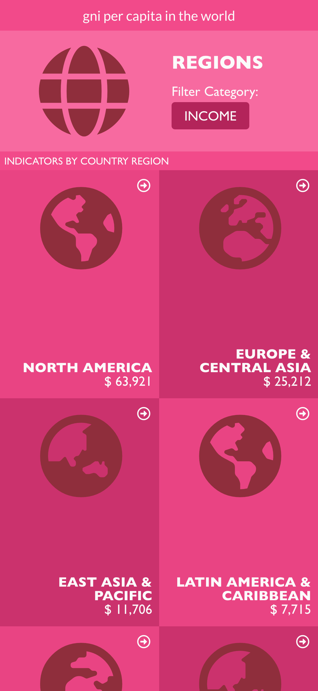
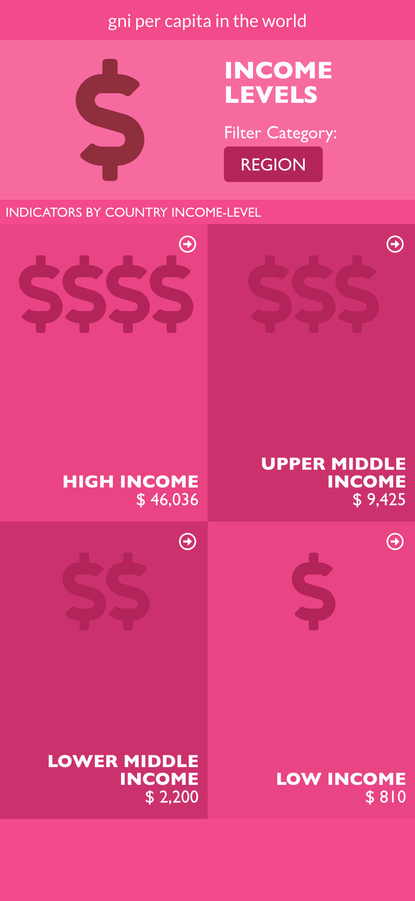
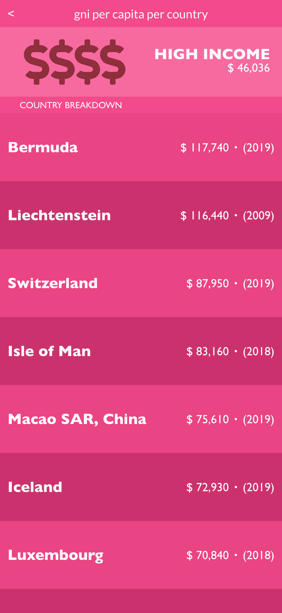

<h1>GNI per Capita in the World</h1>

 
 
 
 
 
 
 
 
 
 

 

This web app shows the GNI per capita indicator for all countries in the world. It consumes the World Bank API. I built it with React and Redux. It was bootstrapped with https://github.com/facebook/create-react-app.

 

## About
In this app, users can see the GNI per Capita Indicator (Atlas Method) of every country in the world. Data are classified according to the geographic location of the country or by its income level. There are two slices for the store, one for the homepage data and another for the detailed view of each country group.

The page consumes the World Bank API located [here](http://api.worldbank.org/v2/). Single API queries are made per page, and only if data doesn't exist in the Redux store. I used **Redux's thunk middleware** to handle all API calls.

For testing I used Jest, React's Testing Library, and MSW (for API mocking).

### Features:
- See indicator data by region, income level, and country.

### Live Demo

Deployed to Netlify: [Live Demo]()

### Built With
- HTML, CSS, JavaScript
- sass 1.38.0
- NPM 7.18.1
- msw 0.35.0
- prop-types 15.7.2
- react-bootstrap: 1.6.1,
- react 17.0.2
- react-redux 7.2.5
- react-router-dom 5.2.0
- chart.js 3.5.1
- redux-logger 3.0.6
- redux-thunk 2.3.0
- uuid 3.4.0
- prop-types 15.7.2
- react-devtools 4.16.0
- Jest-dom 5.11.4
- Netlify
- Linters: ESLint, Stylint
- VS Code

### About the API

- This app consumes the World Bank API. All documentation can be accessed here: https://datahelpdesk.worldbank.org/knowledgebase/topics/125589-developer-information.

- Only 'GET' calls are made to the API.

## Getting Started

To get a local copy up and running, follow these simple example steps.

### Prerequisites
- A browser to open the main file
- Node.js
- NPM
- Yarn

### Get files
1. Open your terminal or command prompt.
2. If you do not have git installed in your system, skip this step and go to step 3; otherwise, go to the directory where you want to copy the project files and clone it by copying this text into your command prompt/terminal: `git@github.com:StarSheriff2/GNI-per-Capita-in-the-World.git`.
 Now go to the ***"Install Dependencies"*** section
3. Download the program files by clicking on the green button that says “**Code**” on the upper right side of the project frame.
4. You will see a dropdown menu. Click on “**Download ZIP**.”
5. Go to the directory where you downloaded the **ZIP file** and open it. Extract its contents to any directory you want in your system.

### Install Dependencies
1. Go to the root directory of the project
2. In your command line, while in the root dir, type `npm install`. It will install all necessary dependencies in your project files
3. Now type `yarn start` or `npm run start`. It will load the project in your default browser.  
**Note: _This command will not stop on its own. If you change something in your project files, it will recompile and reload the page in your browser. To exit, hit "ctrl + c"_**

## Development

### Bundle project

- `yarn build`
### Testing
To test, run

- `yarn test`

### Linters
To run the linters included in this repository, go to the root directory of your repository and copy/paste the following commands into your terminal:
(**Note:** Make sure you run `npm install` before you do this)
- for ESlint, `npx eslint.`
- for Stylelint, `npx stylelint "**/*.{css,scss}"`

### All Available Scripts

 
In the project directory, you can run:

### `yarn start`

Runs the app in the development mode.\
Open [http://localhost:3000](http://localhost:3000) to view it in the browser.

The page will reload if you make edits.\
You will also see any lint warnings in the console.

### `yarn test`

Launches the test runner in the interactive watch mode.\
See the section about [running tests](https://facebook.github.io/create-react-app/docs/running-tests) for more information.

### `yarn build`

Builds the app for production to the `build` folder.\
It correctly bundles React in production mode and optimizes the build for the best performance.

The build is minified and the filenames include the hashes.\
Your app is ready to be deployed!

See the section about [deployment](https://facebook.github.io/create-react-app/docs/deployment) for more information.

### `yarn eject`

**Note: this is a one-way operation. Once you `eject`, you can’t go back!**

If you aren’t satisfied with the build tool and configuration choices, you can `eject` at any time. This command will remove the single build dependency from your project.

Instead, it will copy all the configuration files and the transitive dependencies (webpack, Babel, ESLint, etc) right into your project so you have full control over them. All of the commands except `eject` will still work, but they will point to the copied scripts so you can tweak them. At this point, you’re on your own.

You don’t have to ever use `eject`. The curated feature set is suitable for small and middle deployments, and you shouldn’t feel obligated to use this feature. However, we understand that this tool wouldn’t be useful if you couldn’t customize it when you are ready for it.

## Usage

- See GNI per Capita data by region, income-level of countries, and by country

## Author
👤 **Arturo Alvarez**
- Github: [@StarSheriff2](https://github.com/StarSheriff2)
- Twitter: [@ArturoAlvarezV](https://twitter.com/ArturoAlvarezV)
- Linkedin: [Arturo Alvarez](https://www.linkedin.com/in/arturoalvarezv/)

## 🤝 Contributing

Contributions, issues, and feature requests are welcome!

Feel free to check the [issues page](https://github.com/StarSheriff2/arturos-bookstore/issues).

## 🤝 Acknowledgements

Design:
 - Original design idea by [Nelson Sakwa on Behance](https://www.behance.net/sakwadesignstudio)
 - Licenced under The [Creative Commons license](https://creativecommons.org/licenses/by-nc/4.0/)

## Show your support

Give a ⭐️ if you like this project!

## 📝 License

This project is [MIT](https://github.com/StarSheriff2/GNI-per-Capita-in-the-World/blob/development/LICENSE) licensed.

